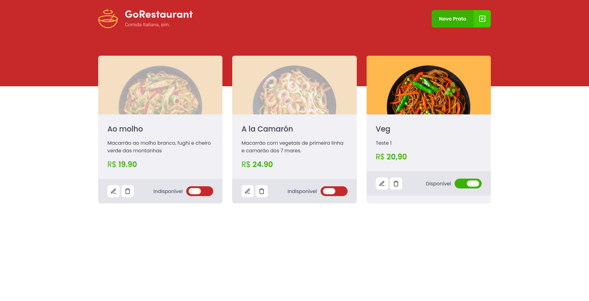
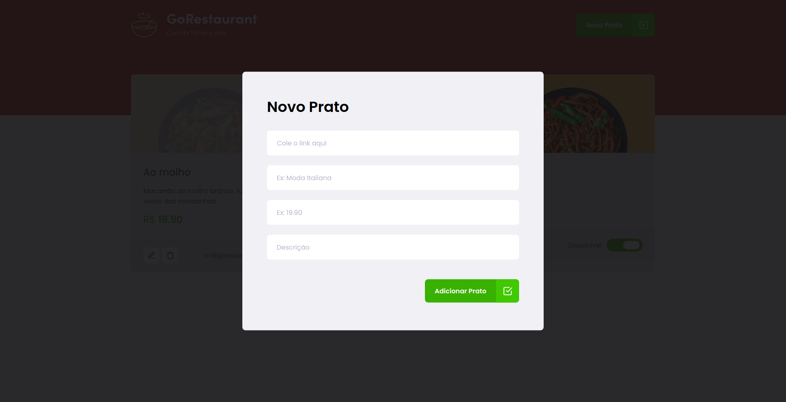

<h2 align="center"> 
  :tomato: GoRestaurant
</h1>

<p align="center">
  <a href="https://www.linkedin.com/in/frank-laercio/">
    
  </a>
  
  
  
  <a href="https://github.com/franklaercio/ig-news/commits/master">
    
  </a>
  
  

  
   <a href="https://github.com/franklaercio/restaurant-react/stargazers">
    
  </a>
</p>

## :bookmark_tabs: Resume of application

This is a simple example of restaurant. Just create dish and define title, price, available and description. In addition, this project was developed during the Ignite of Rocketseat.

<p align="center">
  
  
</p>

This challenge was refactoring all files below to Typescript:

```bash
- src/components/Food/index.jsx;
- src/components/Food/styles.js;
- src/components/Header/index.jsx;
- src/components/Header/styles.js;
- src/components/Input/index.jsx;
- src/components/Input/styles.js;
- src/components/Modal/index.jsx;
- src/components/ModalAddFood/index.jsx;
- src/components/ModalAddFood/styles.js;
- src/components/ModalEditFood/index.jsx;
- src/components/ModalEditFood/styles.js;
- src/pages/Dashboard/index.jsx;
- src/pages/Dashboard/styles.js;
- src/routes/index.jsx;
- src/services/api.js;
- src/styles/global.js;
- src/App.js;
- src/index.js. 
```

## 🎲 Running the project

```bash
# Clone this repository
$ git clone https://github.com/franklaercio/restaurant-react

# Access the project folder in the terminal/cmd
$ cd restaurant-react

# Run the server
$ yarn server

# Run the application
$ yarn start
```

## :man_technologist: Authors

* **Frank Laércio** - [franklaercio](https://github.com/franklaercio)

See also the list of [contributors](https://github.com/franklaercio/restaurant-react/contributors) who participated in this project.

## :clipboard: License

This project is licensed under the MIT License - see the [LICENSE.md](LICENSE.md) file for details

## :newspaper: Acknowledgments

- React
- Hook
- Typescript

Feito com :hearts: by Frank Laércio :wave:!

